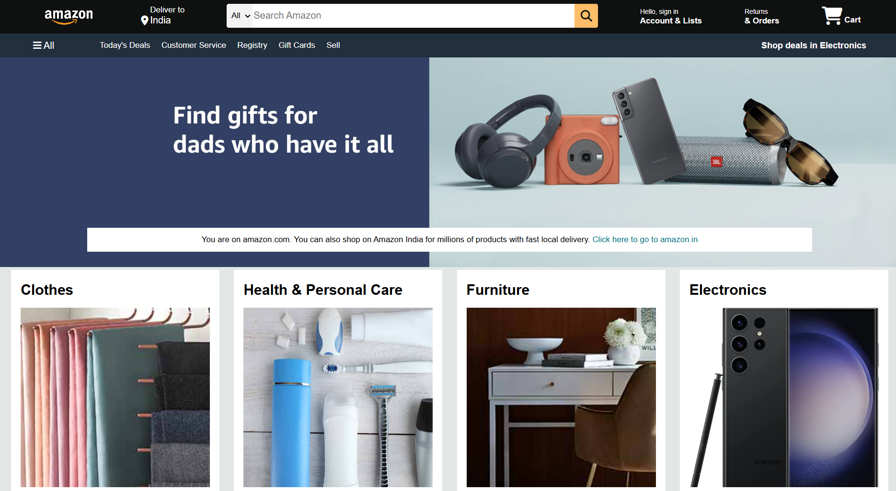

# 🛒 Amazon Clone (HTML + CSS)

This is a simple **Amazon Clone** landing page built using **pure HTML and CSS**. It is fully responsive and designed to mimic the layout of the original Amazon homepage.

## 🧰 Tech Stack

- HTML5  
- CSS3 (Flexbox & Grid)

## 📸 Screenshot



## 💡 Features

- ✅ Amazon-style Navbar with logo, search bar, and cart
- ✅ Product categories section
- ✅ Product cards and promotional banners
- ✅ Responsive layout (mobile-friendly)
- ✅ Footer with multiple links and legal info

## 🚀 How to Use

1. Clone the repository  
```bash
git clone https://github.com/anuj-singal/amazon-clone.git
```
## 📬 Contact

If you'd like to connect or give feedback:

- 📧 Email: anujsingal203@gmail.com  
- 📸 Instagram: [@_anujsingal](https://www.instagram.com/_anujsingal)  
- 💼 LinkedIn: [Anuj Singal](https://www.linkedin.com/in/anujsingal) 
